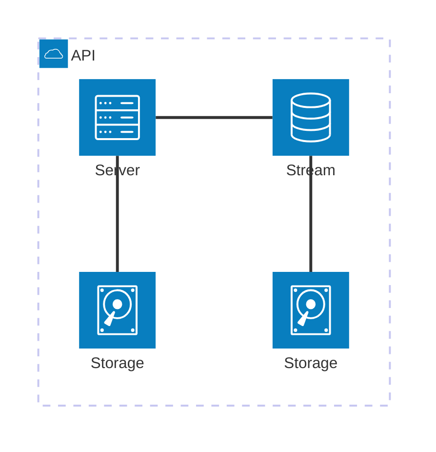

# Setup Env

## Setup DB
```shell
docker run --name pricing-db -e POSTGRES_USER=hello -e POSTGRES_PASSWORD=world -e POSTGRES_DB=pricing -p 5432:5432 -d postgres:latest
```

## Test
```shell
curl --location 'http://localhost:8080/customer/1/order/prices' \
--header 'Content-Type: application/json' \
--data '{
  "productIds": ["1", "2", "3", "4"]
}
'
```

# Architecture

